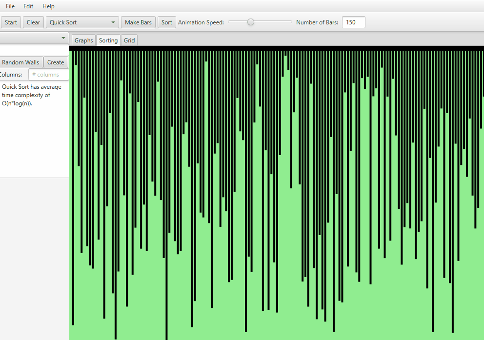
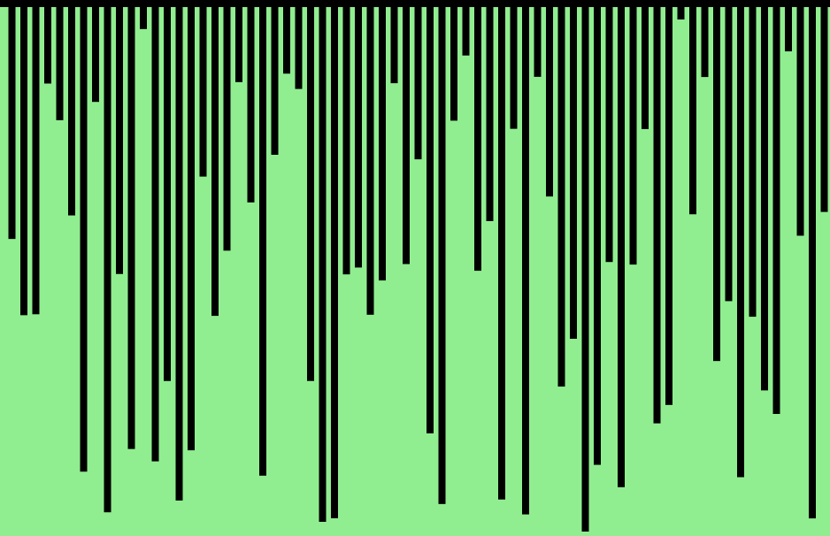

# Algorithm Visualizer Java 🌟

Welcome to the Algorithm Visualizer Java project! 🎉 This is a personal project I created using JavaFX to visualize various types of sorting and path-finding algorithms. 🔍💡

## Features ✨

### Sorting Algorithms 🗂️

- Bubble Sort 🫧
- Binary Search Tree Sort 🌳
- Binary Tree Sort 🌿
- Coctail Sort 🍹
- Heap Sort ⚖️
- Insertion Sort 🪆
- Quick Sort ⚡
- Selection Sort 🔍

### Path-Finding Algorithms 🗺️

- A* Path-Finding Algorithm 🌠
- DFS Maze Generation 🏰
- Dijkstra's Shortest Path Algorithm 📏
- Tree Node Path-Finding 🌴
- Vertex Path-Finding 🔺

## Work in Progress 🚧

Please note that while the sorting algorithms are working properly, the path-finding algorithms are still being refined and improved. 🔧👷‍♂️

## Setup Instructions 🛠️

To run the Algorithm Visualizer Java project on your local machine, follow these steps:

1. Clone the repository: https://github.com/your-username/Algorithm-Visualizer-Java.git

2. Make sure you have Java Development Kit (JDK) installed on your system. 🔧

3. Open the project in your preferred Java IDE (e.g., IntelliJ IDEA, Eclipse). 💻

4. Build the project and resolve any dependencies. 🏗️

5. Run the main class to start the application. ▶️

6. Explore the different algorithms and visualizations! 🔍🎨

## Examples 📷

Here are some examples of the algorithms in action:

### Quick Sort Algorithm ⚡

### Heap Sort ⚖️

### Coctail Sort 🍹

## Contributions 🤝

Contributions to the Algorithm Visualizer Java project are always welcome! If you have any ideas, suggestions, or bug fixes, please feel free to open an issue or submit a pull request. 🙏

## License 📜

This project is licensed under the [MIT License](LICENSE). Feel free to use, modify, and distribute the code as per the terms of the license.

Happy visualizing! 😄🎨
